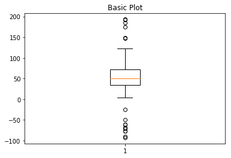
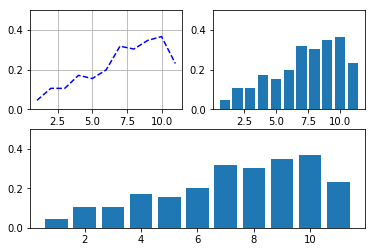
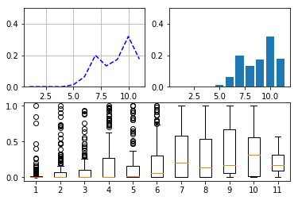
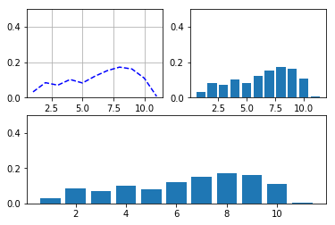

```python
import numpy as np
import matplotlib.pyplot as plt

# Fixing random state for reproducibility
np.random.seed(19680801)

# fake up some data
spread = np.random.rand(50) * 100
center = np.ones(25) * 50
flier_high = np.random.rand(10) * 100 + 100
flier_low = np.random.rand(10) * -100
data = np.concatenate((spread, center, flier_high, flier_low))
```


```python
data.shape
fig1, ax1 = plt.subplots()
ax1.set_title('Basic Plot')
ax1.boxplot(data)
```


    {'whiskers': [<matplotlib.lines.Line2D at 0x7f5ffd1114a8>,
      <matplotlib.lines.Line2D at 0x7f5ffd1117f0>],
     'caps': [<matplotlib.lines.Line2D at 0x7f5ffd111b38>,
      <matplotlib.lines.Line2D at 0x7f5ffd111e80>],
     'boxes': [<matplotlib.lines.Line2D at 0x7f5ffd111358>],
     'medians': [<matplotlib.lines.Line2D at 0x7f5ffd123208>],
     'fliers': [<matplotlib.lines.Line2D at 0x7f5ffd123550>],
     'means': []}





```python
import pandas as pd
!ls
```

     atricals			   'prob_tag_with_ pymorphy.ipynb'
     cloze_task_average_accuracy.xlsx   res.csv
     cloze_task_raw_data.xlsx	    result_tag_new.xls
     Compare_data.ipynb		    result_tag_new.xlsx
     diction_for_tag_replacing.ipynb    result_tag_to_compare.xlsx
     LSTM_probability.xlsx		    result_tag.xls
     LSTM_prob_w_pos.xlsx		    tag_clearing.ipynb
     new_comparing.ipynb		    Tag_cloze_task.ipynb
     output.xlsx			    Untitled1.ipynb


drop all rows were we don't have a contex as a stimulus


```python
row_data = pd.read_excel('cloze_task_raw_data.xlsx')
print(row_data.shape)
row_data = row_data[row_data['shown'] != 'Введите первое слово']
print(row_data.shape)
```

    (64645, 16)
    (57836, 16)


```python
def clear(x):
    flag=0
    if (len(x)==1) and (x not in 'ксявуоиа'):
        flag+=1
    for i in x:
        if i not in 'ячсмитьбюэждлорпавыфйцукенгшщзхъЯЧСМИТЬБЮФЫВАПРОЛДЖЭЪХЗЩЙЦШУГКНЕ':
             flag+=1
    if flag==0:
        return x
    else:
        return 0
row_data.answer = row_data.answer.astype(str)
row_data.answer = row_data.answer.apply(clear)
row_data = row_data[row_data['answer']!=0]
row_data.shape
```


    (57346, 16)


Count number of different answer for each stimulus and alse a index of confusion for rows.
If in experement we have 16 attempts to add the contex, when index of confusion is equel 16/max(all quantities of responses for each stimulus). Smaller the value of confuision, than we can be more confident about this example)


```python
sub_data = row_data[['shown', 'answer', 'word.id']]
grop_data = sub_data[['shown', 'answer']].groupby('shown').size()
grop_data = grop_data.reset_index(level=['shown'])
grop_data.columns = ['shown', 'summ']
grop_data['confusion'] = 1 - grop_data.summ/max(grop_data['summ'])
grop_data
```


<div>
<style scoped>
    .dataframe tbody tr th:only-of-type {
        vertical-align: middle;
    }

    .dataframe tbody tr th {
        vertical-align: top;
    }

    .dataframe thead th {
        text-align: right;
    }
</style>
<table border="1" class="dataframe">
  <thead>
    <tr style="text-align: right;">
      <th></th>
      <th>shown</th>
      <th>summ</th>
      <th>confusion</th>
    </tr>
  </thead>
  <tbody>
    <tr>
      <th>0</th>
      <td>А</td>
      <td>15</td>
      <td>0.978571</td>
    </tr>
    <tr>
      <th>1</th>
      <td>А промывать</td>
      <td>15</td>
      <td>0.978571</td>
    </tr>
    <tr>
      <th>2</th>
      <td>А промывать манную</td>
      <td>15</td>
      <td>0.978571</td>
    </tr>
    <tr>
      <th>3</th>
      <td>А промывать манную крупу</td>
      <td>15</td>
      <td>0.978571</td>
    </tr>
    <tr>
      <th>4</th>
      <td>А промывать манную крупу перед</td>
      <td>15</td>
      <td>0.978571</td>
    </tr>
    <tr>
      <th>5</th>
      <td>А промывать манную крупу перед тем‚</td>
      <td>15</td>
      <td>0.978571</td>
    </tr>
    <tr>
      <th>6</th>
      <td>А промывать манную крупу перед тем‚ как</td>
      <td>15</td>
      <td>0.978571</td>
    </tr>
    <tr>
      <th>7</th>
      <td>А промывать манную крупу перед тем‚ как варить</td>
      <td>15</td>
      <td>0.978571</td>
    </tr>
    <tr>
      <th>8</th>
      <td>А промывать манную крупу перед тем‚ как варить...</td>
      <td>15</td>
      <td>0.978571</td>
    </tr>
    <tr>
      <th>9</th>
      <td>А промывать манную крупу перед тем‚ как варить...</td>
      <td>15</td>
      <td>0.978571</td>
    </tr>
    <tr>
      <th>10</th>
      <td>Автор</td>
      <td>63</td>
      <td>0.910000</td>
    </tr>
    <tr>
      <th>11</th>
      <td>Автор принадлежит</td>
      <td>63</td>
      <td>0.910000</td>
    </tr>
    <tr>
      <th>12</th>
      <td>Автор принадлежит к</td>
      <td>62</td>
      <td>0.911429</td>
    </tr>
    <tr>
      <th>13</th>
      <td>Автор принадлежит к числу</td>
      <td>64</td>
      <td>0.908571</td>
    </tr>
    <tr>
      <th>14</th>
      <td>Автор принадлежит к числу последних</td>
      <td>62</td>
      <td>0.911429</td>
    </tr>
    <tr>
      <th>15</th>
      <td>Автор принадлежит к числу последних свидетелей</td>
      <td>63</td>
      <td>0.910000</td>
    </tr>
    <tr>
      <th>16</th>
      <td>Автор принадлежит к числу последних свидетелей...</td>
      <td>62</td>
      <td>0.911429</td>
    </tr>
    <tr>
      <th>17</th>
      <td>Автор принадлежит к числу последних свидетелей...</td>
      <td>59</td>
      <td>0.915714</td>
    </tr>
    <tr>
      <th>18</th>
      <td>Автор принадлежит к числу последних свидетелей...</td>
      <td>63</td>
      <td>0.910000</td>
    </tr>
    <tr>
      <th>19</th>
      <td>В</td>
      <td>700</td>
      <td>0.000000</td>
    </tr>
    <tr>
      <th>20</th>
      <td>В багажнике</td>
      <td>61</td>
      <td>0.912857</td>
    </tr>
    <tr>
      <th>21</th>
      <td>В багажнике были</td>
      <td>62</td>
      <td>0.911429</td>
    </tr>
    <tr>
      <th>22</th>
      <td>В багажнике были лопата‚</td>
      <td>61</td>
      <td>0.912857</td>
    </tr>
    <tr>
      <th>23</th>
      <td>В багажнике были лопата‚ лом</td>
      <td>62</td>
      <td>0.911429</td>
    </tr>
    <tr>
      <th>24</th>
      <td>В багажнике были лопата‚ лом и</td>
      <td>61</td>
      <td>0.912857</td>
    </tr>
    <tr>
      <th>25</th>
      <td>В вопросе</td>
      <td>19</td>
      <td>0.972857</td>
    </tr>
    <tr>
      <th>26</th>
      <td>В вопросе послышался</td>
      <td>18</td>
      <td>0.974286</td>
    </tr>
    <tr>
      <th>27</th>
      <td>В вопросе послышался упрёк</td>
      <td>19</td>
      <td>0.972857</td>
    </tr>
    <tr>
      <th>28</th>
      <td>В вопросе послышался упрёк командиру‚</td>
      <td>19</td>
      <td>0.972857</td>
    </tr>
    <tr>
      <th>29</th>
      <td>В вопросе послышался упрёк командиру‚ словно</td>
      <td>19</td>
      <td>0.972857</td>
    </tr>
    <tr>
      <th>...</th>
      <td>...</td>
      <td>...</td>
      <td>...</td>
    </tr>
    <tr>
      <th>1139</th>
      <td>Я люблю салат</td>
      <td>91</td>
      <td>0.870000</td>
    </tr>
    <tr>
      <th>1140</th>
      <td>Я люблю салат из</td>
      <td>91</td>
      <td>0.870000</td>
    </tr>
    <tr>
      <th>1141</th>
      <td>Я люблю салат из картошки</td>
      <td>91</td>
      <td>0.870000</td>
    </tr>
    <tr>
      <th>1142</th>
      <td>Я люблю салат из картошки с</td>
      <td>91</td>
      <td>0.870000</td>
    </tr>
    <tr>
      <th>1143</th>
      <td>Я люблю салат из картошки с зеленью‚</td>
      <td>91</td>
      <td>0.870000</td>
    </tr>
    <tr>
      <th>1144</th>
      <td>Я люблю салат из картошки с зеленью‚ заправленный</td>
      <td>91</td>
      <td>0.870000</td>
    </tr>
    <tr>
      <th>1145</th>
      <td>Я люблю салат из картошки с зеленью‚ заправлен...</td>
      <td>90</td>
      <td>0.871429</td>
    </tr>
    <tr>
      <th>1146</th>
      <td>Я люблю салат из картошки с зеленью‚ заправлен...</td>
      <td>90</td>
      <td>0.871429</td>
    </tr>
    <tr>
      <th>1147</th>
      <td>Я сделала</td>
      <td>87</td>
      <td>0.875714</td>
    </tr>
    <tr>
      <th>1148</th>
      <td>Я сделала шаг</td>
      <td>90</td>
      <td>0.871429</td>
    </tr>
    <tr>
      <th>1149</th>
      <td>Я сделала шаг навстречу:</td>
      <td>85</td>
      <td>0.878571</td>
    </tr>
    <tr>
      <th>1150</th>
      <td>Я сделала шаг навстречу: приехала</td>
      <td>89</td>
      <td>0.872857</td>
    </tr>
    <tr>
      <th>1151</th>
      <td>Я сделала шаг навстречу: приехала к</td>
      <td>89</td>
      <td>0.872857</td>
    </tr>
    <tr>
      <th>1152</th>
      <td>Я сделала шаг навстречу: приехала к ней‚</td>
      <td>88</td>
      <td>0.874286</td>
    </tr>
    <tr>
      <th>1153</th>
      <td>Я сделала шаг навстречу: приехала к ней‚ попросив</td>
      <td>89</td>
      <td>0.872857</td>
    </tr>
    <tr>
      <th>1154</th>
      <td>Я сделала шаг навстречу: приехала к ней‚ попро...</td>
      <td>89</td>
      <td>0.872857</td>
    </tr>
    <tr>
      <th>1155</th>
      <td>Я сказал‚</td>
      <td>15</td>
      <td>0.978571</td>
    </tr>
    <tr>
      <th>1156</th>
      <td>Я сказал‚ что</td>
      <td>15</td>
      <td>0.978571</td>
    </tr>
    <tr>
      <th>1157</th>
      <td>Я сказал‚ что русский</td>
      <td>15</td>
      <td>0.978571</td>
    </tr>
    <tr>
      <th>1158</th>
      <td>Я сказал‚ что русский солдат</td>
      <td>15</td>
      <td>0.978571</td>
    </tr>
    <tr>
      <th>1159</th>
      <td>Я сказал‚ что русский солдат омоет</td>
      <td>14</td>
      <td>0.980000</td>
    </tr>
    <tr>
      <th>1160</th>
      <td>Я сказал‚ что русский солдат омоет сапоги</td>
      <td>15</td>
      <td>0.978571</td>
    </tr>
    <tr>
      <th>1161</th>
      <td>Я сказал‚ что русский солдат омоет сапоги в</td>
      <td>15</td>
      <td>0.978571</td>
    </tr>
    <tr>
      <th>1162</th>
      <td>Я сказал‚ что русский солдат омоет сапоги в Ин...</td>
      <td>14</td>
      <td>0.980000</td>
    </tr>
    <tr>
      <th>1163</th>
      <td>Я слезал‚</td>
      <td>18</td>
      <td>0.974286</td>
    </tr>
    <tr>
      <th>1164</th>
      <td>Я слезал‚ щупал</td>
      <td>17</td>
      <td>0.975714</td>
    </tr>
    <tr>
      <th>1165</th>
      <td>Я слезал‚ щупал стога‚</td>
      <td>17</td>
      <td>0.975714</td>
    </tr>
    <tr>
      <th>1166</th>
      <td>Я слезал‚ щупал стога‚ чтобы</td>
      <td>17</td>
      <td>0.975714</td>
    </tr>
    <tr>
      <th>1167</th>
      <td>Я слезал‚ щупал стога‚ чтобы узнать‚</td>
      <td>17</td>
      <td>0.975714</td>
    </tr>
    <tr>
      <th>1168</th>
      <td>Я слезал‚ щупал стога‚ чтобы узнать‚ сухие</td>
      <td>15</td>
      <td>0.978571</td>
    </tr>
  </tbody>
</table>
<p>1169 rows × 3 columns</p>
</div>


Count the quantity of different response for each stimulus 


```python
grop_dats_0 = sub_data[['shown', 'answer']].groupby(['shown','answer']).size()
grop_dats_0 = grop_dats_0.reset_index(level=['shown', 'answer'])
grop_dats_0.columns = ['shown', 'answer', 'freq']
grop_dats_0.head()
```


<div>
<style scoped>
    .dataframe tbody tr th:only-of-type {
        vertical-align: middle;
    }

    .dataframe tbody tr th {
        vertical-align: top;
    }

    .dataframe thead th {
        text-align: right;
    }
</style>
<table border="1" class="dataframe">
  <thead>
    <tr style="text-align: right;">
      <th></th>
      <th>shown</th>
      <th>answer</th>
      <th>freq</th>
    </tr>
  </thead>
  <tbody>
    <tr>
      <th>0</th>
      <td>А</td>
      <td>вот</td>
      <td>1</td>
    </tr>
    <tr>
      <th>1</th>
      <td>А</td>
      <td>где</td>
      <td>1</td>
    </tr>
    <tr>
      <th>2</th>
      <td>А</td>
      <td>ему</td>
      <td>1</td>
    </tr>
    <tr>
      <th>3</th>
      <td>А</td>
      <td>зачем</td>
      <td>1</td>
    </tr>
    <tr>
      <th>4</th>
      <td>А</td>
      <td>знаете</td>
      <td>1</td>
    </tr>
  </tbody>
</table>
</div>


Merge tables


```python
data_res =  sub_data.merge(grop_data, left_on='shown', right_on='shown', how='outer')
data_res =  data_res.merge(grop_dats_0, left_on=['shown','answer'], right_on=['shown','answer'], how='outer')
data_res.head()
```


<div>
<style scoped>
    .dataframe tbody tr th:only-of-type {
        vertical-align: middle;
    }

    .dataframe tbody tr th {
        vertical-align: top;
    }

    .dataframe thead th {
        text-align: right;
    }
</style>
<table border="1" class="dataframe">
  <thead>
    <tr style="text-align: right;">
      <th></th>
      <th>shown</th>
      <th>answer</th>
      <th>word.id</th>
      <th>summ</th>
      <th>confusion</th>
      <th>freq</th>
    </tr>
  </thead>
  <tbody>
    <tr>
      <th>0</th>
      <td>А</td>
      <td>вот</td>
      <td>промывать</td>
      <td>15</td>
      <td>0.978571</td>
      <td>1</td>
    </tr>
    <tr>
      <th>1</th>
      <td>А</td>
      <td>где</td>
      <td>промывать</td>
      <td>15</td>
      <td>0.978571</td>
      <td>1</td>
    </tr>
    <tr>
      <th>2</th>
      <td>А</td>
      <td>ему</td>
      <td>промывать</td>
      <td>15</td>
      <td>0.978571</td>
      <td>1</td>
    </tr>
    <tr>
      <th>3</th>
      <td>А</td>
      <td>зачем</td>
      <td>промывать</td>
      <td>15</td>
      <td>0.978571</td>
      <td>1</td>
    </tr>
    <tr>
      <th>4</th>
      <td>А</td>
      <td>знаете</td>
      <td>промывать</td>
      <td>15</td>
      <td>0.978571</td>
      <td>1</td>
    </tr>
  </tbody>
</table>
</div>


count the prob


```python
import numpy as np
data_res['prob'] = np.where(data_res['word.id']==data_res['answer'], data_res.freq/data_res.summ, 0)
data_res
```


<div>
<style scoped>
    .dataframe tbody tr th:only-of-type {
        vertical-align: middle;
    }

    .dataframe tbody tr th {
        vertical-align: top;
    }

    .dataframe thead th {
        text-align: right;
    }
</style>
<table border="1" class="dataframe">
  <thead>
    <tr style="text-align: right;">
      <th></th>
      <th>shown</th>
      <th>answer</th>
      <th>word.id</th>
      <th>summ</th>
      <th>confusion</th>
      <th>freq</th>
      <th>prob</th>
    </tr>
  </thead>
  <tbody>
    <tr>
      <th>0</th>
      <td>А</td>
      <td>вот</td>
      <td>промывать</td>
      <td>15</td>
      <td>0.978571</td>
      <td>1</td>
      <td>0.0</td>
    </tr>
    <tr>
      <th>1</th>
      <td>А</td>
      <td>где</td>
      <td>промывать</td>
      <td>15</td>
      <td>0.978571</td>
      <td>1</td>
      <td>0.0</td>
    </tr>
    <tr>
      <th>2</th>
      <td>А</td>
      <td>ему</td>
      <td>промывать</td>
      <td>15</td>
      <td>0.978571</td>
      <td>1</td>
      <td>0.0</td>
    </tr>
    <tr>
      <th>3</th>
      <td>А</td>
      <td>зачем</td>
      <td>промывать</td>
      <td>15</td>
      <td>0.978571</td>
      <td>1</td>
      <td>0.0</td>
    </tr>
    <tr>
      <th>4</th>
      <td>А</td>
      <td>знаете</td>
      <td>промывать</td>
      <td>15</td>
      <td>0.978571</td>
      <td>1</td>
      <td>0.0</td>
    </tr>
    <tr>
      <th>5</th>
      <td>А</td>
      <td>зори</td>
      <td>промывать</td>
      <td>15</td>
      <td>0.978571</td>
      <td>1</td>
      <td>0.0</td>
    </tr>
    <tr>
      <th>6</th>
      <td>А</td>
      <td>когда</td>
      <td>промывать</td>
      <td>15</td>
      <td>0.978571</td>
      <td>1</td>
      <td>0.0</td>
    </tr>
    <tr>
      <th>7</th>
      <td>А</td>
      <td>кто</td>
      <td>промывать</td>
      <td>15</td>
      <td>0.978571</td>
      <td>1</td>
      <td>0.0</td>
    </tr>
    <tr>
      <th>8</th>
      <td>А</td>
      <td>он</td>
      <td>промывать</td>
      <td>15</td>
      <td>0.978571</td>
      <td>1</td>
      <td>0.0</td>
    </tr>
    <tr>
      <th>9</th>
      <td>А</td>
      <td>петя</td>
      <td>промывать</td>
      <td>15</td>
      <td>0.978571</td>
      <td>1</td>
      <td>0.0</td>
    </tr>
    <tr>
      <th>10</th>
      <td>А</td>
      <td>тем</td>
      <td>промывать</td>
      <td>15</td>
      <td>0.978571</td>
      <td>1</td>
      <td>0.0</td>
    </tr>
    <tr>
      <th>11</th>
      <td>А</td>
      <td>тот</td>
      <td>промывать</td>
      <td>15</td>
      <td>0.978571</td>
      <td>1</td>
      <td>0.0</td>
    </tr>
    <tr>
      <th>12</th>
      <td>А</td>
      <td>ты</td>
      <td>промывать</td>
      <td>15</td>
      <td>0.978571</td>
      <td>1</td>
      <td>0.0</td>
    </tr>
    <tr>
      <th>13</th>
      <td>А</td>
      <td>что</td>
      <td>промывать</td>
      <td>15</td>
      <td>0.978571</td>
      <td>1</td>
      <td>0.0</td>
    </tr>
    <tr>
      <th>14</th>
      <td>А</td>
      <td>я</td>
      <td>промывать</td>
      <td>15</td>
      <td>0.978571</td>
      <td>1</td>
      <td>0.0</td>
    </tr>
    <tr>
      <th>15</th>
      <td>А промывать</td>
      <td>глаза</td>
      <td>манную</td>
      <td>15</td>
      <td>0.978571</td>
      <td>1</td>
      <td>0.0</td>
    </tr>
    <tr>
      <th>16</th>
      <td>А промывать</td>
      <td>горло</td>
      <td>манную</td>
      <td>15</td>
      <td>0.978571</td>
      <td>1</td>
      <td>0.0</td>
    </tr>
    <tr>
      <th>17</th>
      <td>А промывать</td>
      <td>желудок</td>
      <td>манную</td>
      <td>15</td>
      <td>0.978571</td>
      <td>1</td>
      <td>0.0</td>
    </tr>
    <tr>
      <th>18</th>
      <td>А промывать</td>
      <td>ли</td>
      <td>манную</td>
      <td>15</td>
      <td>0.978571</td>
      <td>1</td>
      <td>0.0</td>
    </tr>
    <tr>
      <th>19</th>
      <td>А промывать</td>
      <td>макароны</td>
      <td>манную</td>
      <td>15</td>
      <td>0.978571</td>
      <td>1</td>
      <td>0.0</td>
    </tr>
    <tr>
      <th>20</th>
      <td>А промывать</td>
      <td>мозги</td>
      <td>манную</td>
      <td>15</td>
      <td>0.978571</td>
      <td>3</td>
      <td>0.0</td>
    </tr>
    <tr>
      <th>21</th>
      <td>А промывать</td>
      <td>мозги</td>
      <td>манную</td>
      <td>15</td>
      <td>0.978571</td>
      <td>3</td>
      <td>0.0</td>
    </tr>
    <tr>
      <th>22</th>
      <td>А промывать</td>
      <td>мозги</td>
      <td>манную</td>
      <td>15</td>
      <td>0.978571</td>
      <td>3</td>
      <td>0.0</td>
    </tr>
    <tr>
      <th>23</th>
      <td>А промывать</td>
      <td>морковь</td>
      <td>манную</td>
      <td>15</td>
      <td>0.978571</td>
      <td>1</td>
      <td>0.0</td>
    </tr>
    <tr>
      <th>24</th>
      <td>А промывать</td>
      <td>нос</td>
      <td>манную</td>
      <td>15</td>
      <td>0.978571</td>
      <td>1</td>
      <td>0.0</td>
    </tr>
    <tr>
      <th>25</th>
      <td>А промывать</td>
      <td>рану</td>
      <td>манную</td>
      <td>15</td>
      <td>0.978571</td>
      <td>4</td>
      <td>0.0</td>
    </tr>
    <tr>
      <th>26</th>
      <td>А промывать</td>
      <td>рану</td>
      <td>манную</td>
      <td>15</td>
      <td>0.978571</td>
      <td>4</td>
      <td>0.0</td>
    </tr>
    <tr>
      <th>27</th>
      <td>А промывать</td>
      <td>рану</td>
      <td>манную</td>
      <td>15</td>
      <td>0.978571</td>
      <td>4</td>
      <td>0.0</td>
    </tr>
    <tr>
      <th>28</th>
      <td>А промывать</td>
      <td>рану</td>
      <td>манную</td>
      <td>15</td>
      <td>0.978571</td>
      <td>4</td>
      <td>0.0</td>
    </tr>
    <tr>
      <th>29</th>
      <td>А промывать</td>
      <td>рис</td>
      <td>манную</td>
      <td>15</td>
      <td>0.978571</td>
      <td>1</td>
      <td>0.0</td>
    </tr>
    <tr>
      <th>...</th>
      <td>...</td>
      <td>...</td>
      <td>...</td>
      <td>...</td>
      <td>...</td>
      <td>...</td>
      <td>...</td>
    </tr>
    <tr>
      <th>57316</th>
      <td>Я слезал‚ щупал стога‚ чтобы узнать‚</td>
      <td>где</td>
      <td>сухие</td>
      <td>17</td>
      <td>0.975714</td>
      <td>4</td>
      <td>0.0</td>
    </tr>
    <tr>
      <th>57317</th>
      <td>Я слезал‚ щупал стога‚ чтобы узнать‚</td>
      <td>где</td>
      <td>сухие</td>
      <td>17</td>
      <td>0.975714</td>
      <td>4</td>
      <td>0.0</td>
    </tr>
    <tr>
      <th>57318</th>
      <td>Я слезал‚ щупал стога‚ чтобы узнать‚</td>
      <td>где</td>
      <td>сухие</td>
      <td>17</td>
      <td>0.975714</td>
      <td>4</td>
      <td>0.0</td>
    </tr>
    <tr>
      <th>57319</th>
      <td>Я слезал‚ щупал стога‚ чтобы узнать‚</td>
      <td>есть</td>
      <td>сухие</td>
      <td>17</td>
      <td>0.975714</td>
      <td>1</td>
      <td>0.0</td>
    </tr>
    <tr>
      <th>57320</th>
      <td>Я слезал‚ щупал стога‚ чтобы узнать‚</td>
      <td>как</td>
      <td>сухие</td>
      <td>17</td>
      <td>0.975714</td>
      <td>3</td>
      <td>0.0</td>
    </tr>
    <tr>
      <th>57321</th>
      <td>Я слезал‚ щупал стога‚ чтобы узнать‚</td>
      <td>как</td>
      <td>сухие</td>
      <td>17</td>
      <td>0.975714</td>
      <td>3</td>
      <td>0.0</td>
    </tr>
    <tr>
      <th>57322</th>
      <td>Я слезал‚ щупал стога‚ чтобы узнать‚</td>
      <td>как</td>
      <td>сухие</td>
      <td>17</td>
      <td>0.975714</td>
      <td>3</td>
      <td>0.0</td>
    </tr>
    <tr>
      <th>57323</th>
      <td>Я слезал‚ щупал стога‚ чтобы узнать‚</td>
      <td>каково</td>
      <td>сухие</td>
      <td>17</td>
      <td>0.975714</td>
      <td>1</td>
      <td>0.0</td>
    </tr>
    <tr>
      <th>57324</th>
      <td>Я слезал‚ щупал стога‚ чтобы узнать‚</td>
      <td>кто</td>
      <td>сухие</td>
      <td>17</td>
      <td>0.975714</td>
      <td>1</td>
      <td>0.0</td>
    </tr>
    <tr>
      <th>57325</th>
      <td>Я слезал‚ щупал стога‚ чтобы узнать‚</td>
      <td>куда</td>
      <td>сухие</td>
      <td>17</td>
      <td>0.975714</td>
      <td>1</td>
      <td>0.0</td>
    </tr>
    <tr>
      <th>57326</th>
      <td>Я слезал‚ щупал стога‚ чтобы узнать‚</td>
      <td>не</td>
      <td>сухие</td>
      <td>17</td>
      <td>0.975714</td>
      <td>1</td>
      <td>0.0</td>
    </tr>
    <tr>
      <th>57327</th>
      <td>Я слезал‚ щупал стога‚ чтобы узнать‚</td>
      <td>что</td>
      <td>сухие</td>
      <td>17</td>
      <td>0.975714</td>
      <td>4</td>
      <td>0.0</td>
    </tr>
    <tr>
      <th>57328</th>
      <td>Я слезал‚ щупал стога‚ чтобы узнать‚</td>
      <td>что</td>
      <td>сухие</td>
      <td>17</td>
      <td>0.975714</td>
      <td>4</td>
      <td>0.0</td>
    </tr>
    <tr>
      <th>57329</th>
      <td>Я слезал‚ щупал стога‚ чтобы узнать‚</td>
      <td>что</td>
      <td>сухие</td>
      <td>17</td>
      <td>0.975714</td>
      <td>4</td>
      <td>0.0</td>
    </tr>
    <tr>
      <th>57330</th>
      <td>Я слезал‚ щупал стога‚ чтобы узнать‚</td>
      <td>что</td>
      <td>сухие</td>
      <td>17</td>
      <td>0.975714</td>
      <td>4</td>
      <td>0.0</td>
    </tr>
    <tr>
      <th>57331</th>
      <td>Я слезал‚ щупал стога‚ чтобы узнать‚ сухие</td>
      <td>ли</td>
      <td>ли</td>
      <td>15</td>
      <td>0.978571</td>
      <td>12</td>
      <td>0.8</td>
    </tr>
    <tr>
      <th>57332</th>
      <td>Я слезал‚ щупал стога‚ чтобы узнать‚ сухие</td>
      <td>ли</td>
      <td>ли</td>
      <td>15</td>
      <td>0.978571</td>
      <td>12</td>
      <td>0.8</td>
    </tr>
    <tr>
      <th>57333</th>
      <td>Я слезал‚ щупал стога‚ чтобы узнать‚ сухие</td>
      <td>ли</td>
      <td>ли</td>
      <td>15</td>
      <td>0.978571</td>
      <td>12</td>
      <td>0.8</td>
    </tr>
    <tr>
      <th>57334</th>
      <td>Я слезал‚ щупал стога‚ чтобы узнать‚ сухие</td>
      <td>ли</td>
      <td>ли</td>
      <td>15</td>
      <td>0.978571</td>
      <td>12</td>
      <td>0.8</td>
    </tr>
    <tr>
      <th>57335</th>
      <td>Я слезал‚ щупал стога‚ чтобы узнать‚ сухие</td>
      <td>ли</td>
      <td>ли</td>
      <td>15</td>
      <td>0.978571</td>
      <td>12</td>
      <td>0.8</td>
    </tr>
    <tr>
      <th>57336</th>
      <td>Я слезал‚ щупал стога‚ чтобы узнать‚ сухие</td>
      <td>ли</td>
      <td>ли</td>
      <td>15</td>
      <td>0.978571</td>
      <td>12</td>
      <td>0.8</td>
    </tr>
    <tr>
      <th>57337</th>
      <td>Я слезал‚ щупал стога‚ чтобы узнать‚ сухие</td>
      <td>ли</td>
      <td>ли</td>
      <td>15</td>
      <td>0.978571</td>
      <td>12</td>
      <td>0.8</td>
    </tr>
    <tr>
      <th>57338</th>
      <td>Я слезал‚ щупал стога‚ чтобы узнать‚ сухие</td>
      <td>ли</td>
      <td>ли</td>
      <td>15</td>
      <td>0.978571</td>
      <td>12</td>
      <td>0.8</td>
    </tr>
    <tr>
      <th>57339</th>
      <td>Я слезал‚ щупал стога‚ чтобы узнать‚ сухие</td>
      <td>ли</td>
      <td>ли</td>
      <td>15</td>
      <td>0.978571</td>
      <td>12</td>
      <td>0.8</td>
    </tr>
    <tr>
      <th>57340</th>
      <td>Я слезал‚ щупал стога‚ чтобы узнать‚ сухие</td>
      <td>ли</td>
      <td>ли</td>
      <td>15</td>
      <td>0.978571</td>
      <td>12</td>
      <td>0.8</td>
    </tr>
    <tr>
      <th>57341</th>
      <td>Я слезал‚ щупал стога‚ чтобы узнать‚ сухие</td>
      <td>ли</td>
      <td>ли</td>
      <td>15</td>
      <td>0.978571</td>
      <td>12</td>
      <td>0.8</td>
    </tr>
    <tr>
      <th>57342</th>
      <td>Я слезал‚ щупал стога‚ чтобы узнать‚ сухие</td>
      <td>ли</td>
      <td>ли</td>
      <td>15</td>
      <td>0.978571</td>
      <td>12</td>
      <td>0.8</td>
    </tr>
    <tr>
      <th>57343</th>
      <td>Я слезал‚ щупал стога‚ чтобы узнать‚ сухие</td>
      <td>они</td>
      <td>ли</td>
      <td>15</td>
      <td>0.978571</td>
      <td>3</td>
      <td>0.0</td>
    </tr>
    <tr>
      <th>57344</th>
      <td>Я слезал‚ щупал стога‚ чтобы узнать‚ сухие</td>
      <td>они</td>
      <td>ли</td>
      <td>15</td>
      <td>0.978571</td>
      <td>3</td>
      <td>0.0</td>
    </tr>
    <tr>
      <th>57345</th>
      <td>Я слезал‚ щупал стога‚ чтобы узнать‚ сухие</td>
      <td>они</td>
      <td>ли</td>
      <td>15</td>
      <td>0.978571</td>
      <td>3</td>
      <td>0.0</td>
    </tr>
  </tbody>
</table>
<p>57346 rows × 7 columns</p>
</div>


check: did I lost some examples or not, as we can see the 


```python
data_res = data_res.drop_duplicates()
j = data_res[['shown', 'prob']].groupby('shown').sum()
j = j.reset_index(level=['shown'])
k =  j.merge(data_res[['shown','word.id']], left_on=['shown'], right_on=['shown'], how='outer')
k = k.drop_duplicates()
s = k.groupby(['shown','word.id']).sum()
s = s.reset_index(level=['shown', 'word.id'])
result = data_res[['shown', 'word.id', 'prob', 'confusion']]
result = result.drop_duplicates()
print(result.shape, s.shape)
result['is_dub'] = result[['shown', 'word.id', 'confusion']].duplicated(keep=False)
g =  result.query('(is_dub == True & prob > 0)|(is_dub==False)')
g
```

    (1853, 4) (1222, 3)


<div>
<style scoped>
    .dataframe tbody tr th:only-of-type {
        vertical-align: middle;
    }

    .dataframe tbody tr th {
        vertical-align: top;
    }

    .dataframe thead th {
        text-align: right;
    }
</style>
<table border="1" class="dataframe">
  <thead>
    <tr style="text-align: right;">
      <th></th>
      <th>shown</th>
      <th>word.id</th>
      <th>prob</th>
      <th>confusion</th>
      <th>is_dub</th>
    </tr>
  </thead>
  <tbody>
    <tr>
      <th>0</th>
      <td>А</td>
      <td>промывать</td>
      <td>0.000000</td>
      <td>0.978571</td>
      <td>False</td>
    </tr>
    <tr>
      <th>15</th>
      <td>А промывать</td>
      <td>манную</td>
      <td>0.000000</td>
      <td>0.978571</td>
      <td>False</td>
    </tr>
    <tr>
      <th>40</th>
      <td>А промывать манную</td>
      <td>крупу</td>
      <td>0.333333</td>
      <td>0.978571</td>
      <td>True</td>
    </tr>
    <tr>
      <th>45</th>
      <td>А промывать манную крупу</td>
      <td>перед</td>
      <td>0.000000</td>
      <td>0.978571</td>
      <td>False</td>
    </tr>
    <tr>
      <th>60</th>
      <td>А промывать манную крупу перед</td>
      <td>тем</td>
      <td>0.000000</td>
      <td>0.978571</td>
      <td>False</td>
    </tr>
    <tr>
      <th>75</th>
      <td>А промывать манную крупу перед тем‚</td>
      <td>как</td>
      <td>1.000000</td>
      <td>0.978571</td>
      <td>False</td>
    </tr>
    <tr>
      <th>90</th>
      <td>А промывать манную крупу перед тем‚ как</td>
      <td>варить</td>
      <td>0.666667</td>
      <td>0.978571</td>
      <td>True</td>
    </tr>
    <tr>
      <th>105</th>
      <td>А промывать манную крупу перед тем‚ как варить</td>
      <td>ее</td>
      <td>0.266667</td>
      <td>0.978571</td>
      <td>True</td>
    </tr>
    <tr>
      <th>123</th>
      <td>А промывать манную крупу перед тем‚ как варить...</td>
      <td>не</td>
      <td>0.600000</td>
      <td>0.978571</td>
      <td>True</td>
    </tr>
    <tr>
      <th>135</th>
      <td>А промывать манную крупу перед тем‚ как варить...</td>
      <td>пробовали</td>
      <td>0.000000</td>
      <td>0.978571</td>
      <td>False</td>
    </tr>
    <tr>
      <th>150</th>
      <td>Автор</td>
      <td>принадлежит</td>
      <td>0.000000</td>
      <td>0.910000</td>
      <td>False</td>
    </tr>
    <tr>
      <th>214</th>
      <td>Автор принадлежит</td>
      <td>к</td>
      <td>0.904762</td>
      <td>0.910000</td>
      <td>True</td>
    </tr>
    <tr>
      <th>320</th>
      <td>Автор принадлежит к</td>
      <td>числу</td>
      <td>0.225806</td>
      <td>0.911429</td>
      <td>True</td>
    </tr>
    <tr>
      <th>338</th>
      <td>Автор принадлежит к числу</td>
      <td>последних</td>
      <td>0.000000</td>
      <td>0.908571</td>
      <td>False</td>
    </tr>
    <tr>
      <th>458</th>
      <td>Автор принадлежит к числу последних</td>
      <td>свидетелей</td>
      <td>0.016129</td>
      <td>0.911429</td>
      <td>True</td>
    </tr>
    <tr>
      <th>507</th>
      <td>Автор принадлежит к числу последних свидетелей</td>
      <td>страшных</td>
      <td>0.015873</td>
      <td>0.910000</td>
      <td>True</td>
    </tr>
    <tr>
      <th>534</th>
      <td>Автор принадлежит к числу последних свидетелей...</td>
      <td>событий</td>
      <td>0.887097</td>
      <td>0.911429</td>
      <td>True</td>
    </tr>
    <tr>
      <th>625</th>
      <td>Автор принадлежит к числу последних свидетелей...</td>
      <td>прошлого</td>
      <td>0.067797</td>
      <td>0.915714</td>
      <td>True</td>
    </tr>
    <tr>
      <th>649</th>
      <td>Автор принадлежит к числу последних свидетелей...</td>
      <td>века</td>
      <td>0.492063</td>
      <td>0.910000</td>
      <td>True</td>
    </tr>
    <tr>
      <th>712</th>
      <td>В</td>
      <td>темноте</td>
      <td>0.000000</td>
      <td>0.000000</td>
      <td>False</td>
    </tr>
    <tr>
      <th>713</th>
      <td>В</td>
      <td>речи</td>
      <td>0.000000</td>
      <td>0.000000</td>
      <td>False</td>
    </tr>
    <tr>
      <th>714</th>
      <td>В</td>
      <td>конверте</td>
      <td>0.000000</td>
      <td>0.000000</td>
      <td>False</td>
    </tr>
    <tr>
      <th>715</th>
      <td>В</td>
      <td>котел</td>
      <td>0.000000</td>
      <td>0.000000</td>
      <td>False</td>
    </tr>
    <tr>
      <th>725</th>
      <td>В</td>
      <td>сюжете</td>
      <td>0.000000</td>
      <td>0.000000</td>
      <td>False</td>
    </tr>
    <tr>
      <th>732</th>
      <td>В</td>
      <td>багажнике</td>
      <td>0.000000</td>
      <td>0.000000</td>
      <td>False</td>
    </tr>
    <tr>
      <th>735</th>
      <td>В</td>
      <td>современном</td>
      <td>0.000000</td>
      <td>0.000000</td>
      <td>False</td>
    </tr>
    <tr>
      <th>754</th>
      <td>В</td>
      <td>вопросе</td>
      <td>0.000000</td>
      <td>0.000000</td>
      <td>False</td>
    </tr>
    <tr>
      <th>761</th>
      <td>В</td>
      <td>качестве</td>
      <td>0.000000</td>
      <td>0.000000</td>
      <td>False</td>
    </tr>
    <tr>
      <th>764</th>
      <td>В</td>
      <td>мои</td>
      <td>0.000000</td>
      <td>0.000000</td>
      <td>False</td>
    </tr>
    <tr>
      <th>777</th>
      <td>В</td>
      <td>тот</td>
      <td>0.000000</td>
      <td>0.000000</td>
      <td>False</td>
    </tr>
    <tr>
      <th>...</th>
      <td>...</td>
      <td>...</td>
      <td>...</td>
      <td>...</td>
      <td>...</td>
    </tr>
    <tr>
      <th>55708</th>
      <td>Я люблю салат</td>
      <td>из</td>
      <td>0.384615</td>
      <td>0.870000</td>
      <td>True</td>
    </tr>
    <tr>
      <th>55786</th>
      <td>Я люблю салат из</td>
      <td>картошки</td>
      <td>0.000000</td>
      <td>0.870000</td>
      <td>False</td>
    </tr>
    <tr>
      <th>55940</th>
      <td>Я люблю салат из картошки</td>
      <td>с</td>
      <td>0.307692</td>
      <td>0.870000</td>
      <td>True</td>
    </tr>
    <tr>
      <th>55978</th>
      <td>Я люблю салат из картошки с</td>
      <td>зеленью</td>
      <td>0.021978</td>
      <td>0.870000</td>
      <td>True</td>
    </tr>
    <tr>
      <th>56066</th>
      <td>Я люблю салат из картошки с зеленью‚</td>
      <td>заправленный</td>
      <td>0.065934</td>
      <td>0.870000</td>
      <td>True</td>
    </tr>
    <tr>
      <th>56150</th>
      <td>Я люблю салат из картошки с зеленью‚ заправленный</td>
      <td>пахучим</td>
      <td>0.000000</td>
      <td>0.870000</td>
      <td>False</td>
    </tr>
    <tr>
      <th>56297</th>
      <td>Я люблю салат из картошки с зеленью‚ заправлен...</td>
      <td>подсолнечным</td>
      <td>0.088889</td>
      <td>0.871429</td>
      <td>True</td>
    </tr>
    <tr>
      <th>56332</th>
      <td>Я люблю салат из картошки с зеленью‚ заправлен...</td>
      <td>маслом</td>
      <td>0.988889</td>
      <td>0.871429</td>
      <td>True</td>
    </tr>
    <tr>
      <th>56498</th>
      <td>Я сделала</td>
      <td>шаг</td>
      <td>0.057471</td>
      <td>0.875714</td>
      <td>True</td>
    </tr>
    <tr>
      <th>56575</th>
      <td>Я сделала шаг</td>
      <td>навстречу</td>
      <td>0.177778</td>
      <td>0.871429</td>
      <td>True</td>
    </tr>
    <tr>
      <th>56598</th>
      <td>Я сделала шаг навстречу:</td>
      <td>приехала</td>
      <td>0.000000</td>
      <td>0.878571</td>
      <td>False</td>
    </tr>
    <tr>
      <th>56702</th>
      <td>Я сделала шаг навстречу: приехала</td>
      <td>к</td>
      <td>0.314607</td>
      <td>0.872857</td>
      <td>True</td>
    </tr>
    <tr>
      <th>56772</th>
      <td>Я сделала шаг навстречу: приехала к</td>
      <td>ней</td>
      <td>0.000000</td>
      <td>0.872857</td>
      <td>False</td>
    </tr>
    <tr>
      <th>56927</th>
      <td>Я сделала шаг навстречу: приехала к ней‚</td>
      <td>попросив</td>
      <td>0.011364</td>
      <td>0.874286</td>
      <td>True</td>
    </tr>
    <tr>
      <th>56956</th>
      <td>Я сделала шаг навстречу: приехала к ней‚ попросив</td>
      <td>выслушать</td>
      <td>0.033708</td>
      <td>0.872857</td>
      <td>True</td>
    </tr>
    <tr>
      <th>57044</th>
      <td>Я сделала шаг навстречу: приехала к ней‚ попро...</td>
      <td>меня</td>
      <td>0.752809</td>
      <td>0.872857</td>
      <td>True</td>
    </tr>
    <tr>
      <th>57127</th>
      <td>Я сказал‚</td>
      <td>что</td>
      <td>1.000000</td>
      <td>0.978571</td>
      <td>False</td>
    </tr>
    <tr>
      <th>57142</th>
      <td>Я сказал‚ что</td>
      <td>русский</td>
      <td>0.000000</td>
      <td>0.978571</td>
      <td>False</td>
    </tr>
    <tr>
      <th>57157</th>
      <td>Я сказал‚ что русский</td>
      <td>солдат</td>
      <td>0.000000</td>
      <td>0.978571</td>
      <td>False</td>
    </tr>
    <tr>
      <th>57172</th>
      <td>Я сказал‚ что русский солдат</td>
      <td>омоет</td>
      <td>0.000000</td>
      <td>0.978571</td>
      <td>False</td>
    </tr>
    <tr>
      <th>57198</th>
      <td>Я сказал‚ что русский солдат омоет</td>
      <td>сапоги</td>
      <td>0.142857</td>
      <td>0.980000</td>
      <td>True</td>
    </tr>
    <tr>
      <th>57201</th>
      <td>Я сказал‚ что русский солдат омоет сапоги</td>
      <td>в</td>
      <td>0.533333</td>
      <td>0.978571</td>
      <td>True</td>
    </tr>
    <tr>
      <th>57217</th>
      <td>Я сказал‚ что русский солдат омоет сапоги в</td>
      <td>индийском</td>
      <td>0.400000</td>
      <td>0.978571</td>
      <td>True</td>
    </tr>
    <tr>
      <th>57231</th>
      <td>Я сказал‚ что русский солдат омоет сапоги в Ин...</td>
      <td>океане</td>
      <td>1.000000</td>
      <td>0.980000</td>
      <td>False</td>
    </tr>
    <tr>
      <th>57245</th>
      <td>Я слезал‚</td>
      <td>щупал</td>
      <td>0.000000</td>
      <td>0.974286</td>
      <td>False</td>
    </tr>
    <tr>
      <th>57263</th>
      <td>Я слезал‚ щупал</td>
      <td>стога</td>
      <td>0.000000</td>
      <td>0.975714</td>
      <td>False</td>
    </tr>
    <tr>
      <th>57280</th>
      <td>Я слезал‚ щупал стога‚</td>
      <td>чтобы</td>
      <td>0.000000</td>
      <td>0.975714</td>
      <td>False</td>
    </tr>
    <tr>
      <th>57297</th>
      <td>Я слезал‚ щупал стога‚ чтобы</td>
      <td>узнать</td>
      <td>0.000000</td>
      <td>0.975714</td>
      <td>False</td>
    </tr>
    <tr>
      <th>57314</th>
      <td>Я слезал‚ щупал стога‚ чтобы узнать‚</td>
      <td>сухие</td>
      <td>0.000000</td>
      <td>0.975714</td>
      <td>False</td>
    </tr>
    <tr>
      <th>57331</th>
      <td>Я слезал‚ щупал стога‚ чтобы узнать‚ сухие</td>
      <td>ли</td>
      <td>0.800000</td>
      <td>0.978571</td>
      <td>True</td>
    </tr>
  </tbody>
</table>
<p>1222 rows × 5 columns</p>
</div>


```python
sub_data[['shown','word.id']].drop_duplicates().shape
```


    (1222, 2)


The window above can show us how the mean of probabilities is distributed by the lenght of the previos context. I do think that distribution of cloze task is close to slow expanencial(but only up on some threshold, in our case it is ten-word-context). 


```python
import matplotlib.pyplot as plt 

plot_data = g[['shown', 'prob']]
def get_len(x):
    return len(x.split())

def plot_mean_prob_distribution(plot_data):
    plot_data['context_len'] = plot_data.shown.apply(get_len)
    x1 = plot_data.groupby('context_len').sum()
    x1 = x1.reset_index(level=['context_len'])
    x2 = plot_data.groupby('context_len').size()
    x2 = x2.reset_index(level=['context_len'])
    plotting = x1.merge(x2, left_on = 'context_len', right_on = 'context_len', how = 'outer')
    plotting.columns = ['context_len', 'prob', 'abs_freq']
    plotting['frequency'] = plotting['prob']/plotting['abs_freq']
    
    plt.subplot(221)
    plot1, =plt.plot(plotting.context_len.tolist(), plotting.frequency.tolist(), 'b--', label="$y=x^2$")
    plt.ylim(0,0.5)
    plt.grid()

    plt.subplot(222)
    plt.bar(x= plotting.context_len.tolist(), height = plotting.frequency.tolist())
    plt.ylim(0,0.5)
    
    plt.subplot(212)
    plt.bar(x= plotting.context_len.tolist(), height = plotting.frequency.tolist())
    plt.ylim(0,0.5)

    _=plt.show()
    
plot_mean_prob_distribution(plot_data)
```

    /home/semen/.local/lib/python3.6/site-packages/ipykernel_launcher.py:8: SettingWithCopyWarning: 
    A value is trying to be set on a copy of a slice from a DataFrame.
    Try using .loc[row_indexer,col_indexer] = value instead
    
    See the caveats in the documentation: http://pandas.pydata.org/pandas-docs/stable/indexing.html#indexing-view-versus-copy
      





Compute median and plot it. Why it is also necessary? Because the median values are more stable and less dependant on the "emmissions" of the model.


```python
import numpy as np

def tl(x):
    d = []
    d.append(x)
    return d

def mediann(x):
    return np.median(x)

def plot_median_distribution(plot_data):
    
    plot_data['context_len'] = plot_data.shown.apply(get_len)
    plot_data.prob = plot_data.prob.apply(tl)
    x1 = plot_data.groupby('context_len').sum()
    x1 = x1.reset_index(level=['context_len'])
    plotting = x1
    print(x1)

    plotting['mediann'] = plotting['prob'].apply(mediann)
    
    data = np.array(plotting.prob)
    print(data.shape)

    plt.subplot(221)
    plot1, =plt.plot(plotting.context_len.tolist(), plotting.mediann.tolist(), 'b--', label="$y=x^2$")
    plt.ylim(0,0.5)
    plt.grid()

    plt.subplot(222)
    plt.bar(x= plotting.context_len.tolist(), height = plotting.mediann.tolist())
    plt.ylim(0,0.5)
    
    plt.subplot(212)
    plt.boxplot(data)
    

    _=plt.show()

    
plot_median_distribution(plot_data)
```

    /home/semen/.local/lib/python3.6/site-packages/ipykernel_launcher.py:13: SettingWithCopyWarning: 
    A value is trying to be set on a copy of a slice from a DataFrame.
    Try using .loc[row_indexer,col_indexer] = value instead
    
    See the caveats in the documentation: http://pandas.pydata.org/pandas-docs/stable/indexing.html#indexing-view-versus-copy
      del sys.path[0]
    /home/semen/.local/lib/python3.6/site-packages/pandas/core/generic.py:4405: SettingWithCopyWarning: 
    A value is trying to be set on a copy of a slice from a DataFrame.
    Try using .loc[row_indexer,col_indexer] = value instead
    
    See the caveats in the documentation: http://pandas.pydata.org/pandas-docs/stable/indexing.html#indexing-view-versus-copy
      self[name] = value


        context_len                                              shown  \
    0             1  ААвторВВВВВВВВВВВВВВВВаняВзявВластьВоВозможнос...   
    1             2  А промыватьАвтор принадлежитВ багажникеВ вопро...   
    2             3  А промывать маннуюАвтор принадлежит кВ багажни...   
    3             4  А промывать манную крупуАвтор принадлежит к чи...   
    4             5  А промывать манную крупу передАвтор принадлежи...   
    5             6  А промывать манную крупу перед тем‚Автор прина...   
    6             7  А промывать манную крупу перед тем‚ какАвтор п...   
    7             8  А промывать манную крупу перед тем‚ как варить...   
    8             9  А промывать манную крупу перед тем‚ как варить...   
    9            10  А промывать манную крупу перед тем‚ как варить...   
    10           11  Ваня раскрыл было рот‚ но понял‚ что что-то не...   
    
                                                     prob  
    0   [0.0, 0.0, 0.0, 0.0, 0.0, 0.0, 0.0, 0.0, 0.0, ...  
    1   [0.0, 0.9047619047619048, 0.0, 0.0, 0.0, 0.0, ...  
    2   [0.3333333333333333, 0.22580645161290322, 0.0,...  
    3   [0.0, 0.0, 0.01639344262295082, 0.0, 0.4, 0.0,...  
    4   [0.0, 0.016129032258064516, 0.6290322580645161...  
    5   [1.0, 0.015873015873015872, 0.0491803278688524...  
    6   [0.6666666666666666, 0.8870967741935484, 0.473...  
    7   [0.26666666666666666, 0.06779661016949153, 0.0...  
    8   [0.6, 0.49206349206349204, 0.16666666666666666...  
    9   [0.0, 0.28, 0.0, 0.029411764705882353, 0.06493...  
    10  [0.125, 0.5735294117647058, 0.0, 0.22641509433...  
    (11,)





```python
lstm = pd.read_excel('LSTM_prob_w_pos.xlsx')
```


```python
lstm[['shown','answer']].drop_duplicates().shape
```


    (1312, 2)


```python
sub_lstm = lstm[['shown','answer', 'prob', 'pos.tag']]
sub_lstm = sub_lstm[sub_lstm.shown != 'Введите первое слово']
sub_lstm.shape
```


    (1223, 4)


```python
plot_data_lstm = sub_lstm[['shown', 'prob']]
plot_mean_prob_distribution(plot_data_lstm)
```

    /home/semen/.local/lib/python3.6/site-packages/ipykernel_launcher.py:8: SettingWithCopyWarning: 
    A value is trying to be set on a copy of a slice from a DataFrame.
    Try using .loc[row_indexer,col_indexer] = value instead
    
    See the caveats in the documentation: http://pandas.pydata.org/pandas-docs/stable/indexing.html#indexing-view-versus-copy
      





```python
plot_median_distribution(plot_data_lstm)
```

    /home/semen/.local/lib/python3.6/site-packages/ipykernel_launcher.py:13: SettingWithCopyWarning: 
    A value is trying to be set on a copy of a slice from a DataFrame.
    Try using .loc[row_indexer,col_indexer] = value instead
    
    See the caveats in the documentation: http://pandas.pydata.org/pandas-docs/stable/indexing.html#indexing-view-versus-copy
      del sys.path[0]


        context_len                                              shown  \
    0             1  НаОнВаняСделавЯДорогаНеВыходяИУОченьНаНаживка‚...   
    1             2  На болотахОн ловкоВаня раскрылСделав мнеЯ сдел...   
    2             3  На болотах оставалсяОн ловко подделВаня раскры...   
    3             4  На болотах оставался ещёОн ловко поддел концом...   
    4             5  На болотах оставался ещё лёд‚Он ловко поддел к...   
    5             6  На болотах оставался ещё лёд‚ ноОн ловко подде...   
    6             7  На болотах оставался ещё лёд‚ но наОн ловко по...   
    7             8  На болотах оставался ещё лёд‚ но на берегахОн ...   
    8             9  На болотах оставался ещё лёд‚ но на берегах ре...   
    9            10  На болотах оставался ещё лёд‚ но на берегах ре...   
    10           11  Ваня раскрыл было рот‚ но понял‚ что что-то не...   
    
                                                     prob  
    0   [6.42355e-06, 6.83756e-05, 0.000194429, 0.0005...  
    1   [0.000137509, 0.004475961, 0.004079005, 0.0029...  
    2   [0.124898523, 0.000468281, 0.467625082, 6.3116...  
    3   [0.002192784, 0.045508154, 0.66102916, 0.16416...  
    4   [0.039916713, 2.0346e-06, 0.004546021, 0.00085...  
    5   [0.031502113, 0.051944204, 0.958914459, 0.1155...  
    6   [0.003701243, 0.07215149, 0.001715297, 0.82618...  
    7   [0.014211794, 0.002742183, 0.241921723, 0.0154...  
    8   [0.000669886, 0.575578451, 0.13798739, 0.00255...  
    9   [0.003874259, 0.45231384, 0.000377545, 0.00250...  
    10  [0.000886227, 0.00881911, 0.014447753, 0.00150...  
    (11,)


```python
ggg = g.merge(sub_lstm, left_on=['shown','word.id'], right_on=['shown','answer'], how='outer')
ress = ggg[['shown','word.id', 'prob_x', 'confusion', 'prob_y', 'pos.tag']]
ress
```


<div>
<style scoped>
    .dataframe tbody tr th:only-of-type {
        vertical-align: middle;
    }

    .dataframe tbody tr th {
        vertical-align: top;
    }

    .dataframe thead th {
        text-align: right;
    }
</style>
<table border="1" class="dataframe">
  <thead>
    <tr style="text-align: right;">
      <th></th>
      <th>shown</th>
      <th>word.id</th>
      <th>prob_x</th>
      <th>confusion</th>
      <th>prob_y</th>
      <th>pos.tag</th>
    </tr>
  </thead>
  <tbody>
    <tr>
      <th>0</th>
      <td>А</td>
      <td>промывать</td>
      <td>0.000000</td>
      <td>0.978571</td>
      <td>1.986770e-07</td>
      <td>INFN</td>
    </tr>
    <tr>
      <th>1</th>
      <td>А промывать</td>
      <td>манную</td>
      <td>0.000000</td>
      <td>0.978571</td>
      <td>9.952960e-06</td>
      <td>ADJF</td>
    </tr>
    <tr>
      <th>2</th>
      <td>А промывать манную</td>
      <td>крупу</td>
      <td>0.333333</td>
      <td>0.978571</td>
      <td>9.152956e-02</td>
      <td>NOUN</td>
    </tr>
    <tr>
      <th>3</th>
      <td>А промывать манную крупу</td>
      <td>перед</td>
      <td>0.000000</td>
      <td>0.978571</td>
      <td>7.796750e-04</td>
      <td>PREP</td>
    </tr>
    <tr>
      <th>4</th>
      <td>А промывать манную крупу перед</td>
      <td>тем</td>
      <td>0.000000</td>
      <td>0.978571</td>
      <td>1.503523e-02</td>
      <td>CONJ</td>
    </tr>
    <tr>
      <th>5</th>
      <td>А промывать манную крупу перед тем‚</td>
      <td>как</td>
      <td>1.000000</td>
      <td>0.978571</td>
      <td>9.661542e-01</td>
      <td>CONJ</td>
    </tr>
    <tr>
      <th>6</th>
      <td>А промывать манную крупу перед тем‚ как</td>
      <td>варить</td>
      <td>0.666667</td>
      <td>0.978571</td>
      <td>1.186796e-02</td>
      <td>INFN</td>
    </tr>
    <tr>
      <th>7</th>
      <td>А промывать манную крупу перед тем‚ как варить</td>
      <td>ее</td>
      <td>0.266667</td>
      <td>0.978571</td>
      <td>4.090891e-02</td>
      <td>NPRO</td>
    </tr>
    <tr>
      <th>8</th>
      <td>А промывать манную крупу перед тем‚ как варить...</td>
      <td>не</td>
      <td>0.600000</td>
      <td>0.978571</td>
      <td>1.469520e-01</td>
      <td>PRCL</td>
    </tr>
    <tr>
      <th>9</th>
      <td>А промывать манную крупу перед тем‚ как варить...</td>
      <td>пробовали</td>
      <td>0.000000</td>
      <td>0.978571</td>
      <td>8.291220e-04</td>
      <td>VERB</td>
    </tr>
    <tr>
      <th>10</th>
      <td>Автор</td>
      <td>принадлежит</td>
      <td>0.000000</td>
      <td>0.910000</td>
      <td>1.349750e-04</td>
      <td>VERB</td>
    </tr>
    <tr>
      <th>11</th>
      <td>Автор принадлежит</td>
      <td>к</td>
      <td>0.904762</td>
      <td>0.910000</td>
      <td>7.000707e-01</td>
      <td>PREP</td>
    </tr>
    <tr>
      <th>12</th>
      <td>Автор принадлежит к</td>
      <td>числу</td>
      <td>0.225806</td>
      <td>0.911429</td>
      <td>3.111598e-01</td>
      <td>NOUN</td>
    </tr>
    <tr>
      <th>13</th>
      <td>Автор принадлежит к числу</td>
      <td>последних</td>
      <td>0.000000</td>
      <td>0.908571</td>
      <td>1.234424e-02</td>
      <td>ADJF</td>
    </tr>
    <tr>
      <th>14</th>
      <td>Автор принадлежит к числу последних</td>
      <td>свидетелей</td>
      <td>0.016129</td>
      <td>0.911429</td>
      <td>5.175420e-05</td>
      <td>NOUN</td>
    </tr>
    <tr>
      <th>15</th>
      <td>Автор принадлежит к числу последних свидетелей</td>
      <td>страшных</td>
      <td>0.015873</td>
      <td>0.910000</td>
      <td>6.572510e-05</td>
      <td>ADJF</td>
    </tr>
    <tr>
      <th>16</th>
      <td>Автор принадлежит к числу последних свидетелей...</td>
      <td>событий</td>
      <td>0.887097</td>
      <td>0.911429</td>
      <td>4.729219e-01</td>
      <td>NOUN</td>
    </tr>
    <tr>
      <th>17</th>
      <td>Автор принадлежит к числу последних свидетелей...</td>
      <td>прошлого</td>
      <td>0.067797</td>
      <td>0.915714</td>
      <td>2.835200e-02</td>
      <td>ADJF</td>
    </tr>
    <tr>
      <th>18</th>
      <td>Автор принадлежит к числу последних свидетелей...</td>
      <td>века</td>
      <td>0.492063</td>
      <td>0.910000</td>
      <td>7.007810e-01</td>
      <td>NOUN</td>
    </tr>
    <tr>
      <th>19</th>
      <td>В</td>
      <td>темноте</td>
      <td>0.000000</td>
      <td>0.000000</td>
      <td>1.612600e-04</td>
      <td>NOUN</td>
    </tr>
    <tr>
      <th>20</th>
      <td>В</td>
      <td>речи</td>
      <td>0.000000</td>
      <td>0.000000</td>
      <td>3.243340e-05</td>
      <td>NOUN</td>
    </tr>
    <tr>
      <th>21</th>
      <td>В</td>
      <td>конверте</td>
      <td>0.000000</td>
      <td>0.000000</td>
      <td>8.010120e-06</td>
      <td>NOUN</td>
    </tr>
    <tr>
      <th>22</th>
      <td>В</td>
      <td>котел</td>
      <td>0.000000</td>
      <td>0.000000</td>
      <td>1.474280e-06</td>
      <td>NOUN</td>
    </tr>
    <tr>
      <th>23</th>
      <td>В</td>
      <td>сюжете</td>
      <td>0.000000</td>
      <td>0.000000</td>
      <td>3.578690e-05</td>
      <td>NOUN</td>
    </tr>
    <tr>
      <th>24</th>
      <td>В</td>
      <td>багажнике</td>
      <td>0.000000</td>
      <td>0.000000</td>
      <td>5.739320e-05</td>
      <td>NOUN</td>
    </tr>
    <tr>
      <th>25</th>
      <td>В</td>
      <td>современном</td>
      <td>0.000000</td>
      <td>0.000000</td>
      <td>2.667250e-04</td>
      <td>ADJF</td>
    </tr>
    <tr>
      <th>26</th>
      <td>В</td>
      <td>вопросе</td>
      <td>0.000000</td>
      <td>0.000000</td>
      <td>8.127780e-05</td>
      <td>NOUN</td>
    </tr>
    <tr>
      <th>27</th>
      <td>В</td>
      <td>качестве</td>
      <td>0.000000</td>
      <td>0.000000</td>
      <td>6.771370e-03</td>
      <td>NOUN</td>
    </tr>
    <tr>
      <th>28</th>
      <td>В</td>
      <td>мои</td>
      <td>0.000000</td>
      <td>0.000000</td>
      <td>3.105170e-05</td>
      <td>ADJF</td>
    </tr>
    <tr>
      <th>29</th>
      <td>В</td>
      <td>тот</td>
      <td>0.000000</td>
      <td>0.000000</td>
      <td>4.990743e-03</td>
      <td>ADJF</td>
    </tr>
    <tr>
      <th>...</th>
      <td>...</td>
      <td>...</td>
      <td>...</td>
      <td>...</td>
      <td>...</td>
      <td>...</td>
    </tr>
    <tr>
      <th>1193</th>
      <td>Я люблю салат</td>
      <td>из</td>
      <td>0.384615</td>
      <td>0.870000</td>
      <td>3.144622e-01</td>
      <td>PREP</td>
    </tr>
    <tr>
      <th>1194</th>
      <td>Я люблю салат из</td>
      <td>картошки</td>
      <td>0.000000</td>
      <td>0.870000</td>
      <td>7.207496e-03</td>
      <td>NOUN</td>
    </tr>
    <tr>
      <th>1195</th>
      <td>Я люблю салат из картошки</td>
      <td>с</td>
      <td>0.307692</td>
      <td>0.870000</td>
      <td>1.106943e-01</td>
      <td>PREP</td>
    </tr>
    <tr>
      <th>1196</th>
      <td>Я люблю салат из картошки с</td>
      <td>зеленью</td>
      <td>0.021978</td>
      <td>0.870000</td>
      <td>4.130071e-03</td>
      <td>NOUN</td>
    </tr>
    <tr>
      <th>1197</th>
      <td>Я люблю салат из картошки с зеленью‚</td>
      <td>заправленный</td>
      <td>0.065934</td>
      <td>0.870000</td>
      <td>3.231950e-04</td>
      <td>PRTF</td>
    </tr>
    <tr>
      <th>1198</th>
      <td>Я люблю салат из картошки с зеленью‚ заправленный</td>
      <td>пахучим</td>
      <td>0.000000</td>
      <td>0.870000</td>
      <td>2.960270e-05</td>
      <td>ADJF</td>
    </tr>
    <tr>
      <th>1199</th>
      <td>Я люблю салат из картошки с зеленью‚ заправлен...</td>
      <td>подсолнечным</td>
      <td>0.088889</td>
      <td>0.871429</td>
      <td>2.354350e-03</td>
      <td>ADJF</td>
    </tr>
    <tr>
      <th>1200</th>
      <td>Я люблю салат из картошки с зеленью‚ заправлен...</td>
      <td>маслом</td>
      <td>0.988889</td>
      <td>0.871429</td>
      <td>8.389298e-01</td>
      <td>NOUN</td>
    </tr>
    <tr>
      <th>1201</th>
      <td>Я сделала</td>
      <td>шаг</td>
      <td>0.057471</td>
      <td>0.875714</td>
      <td>2.333184e-02</td>
      <td>NOUN</td>
    </tr>
    <tr>
      <th>1202</th>
      <td>Я сделала шаг</td>
      <td>навстречу</td>
      <td>0.177778</td>
      <td>0.871429</td>
      <td>4.213972e-02</td>
      <td>ADVB</td>
    </tr>
    <tr>
      <th>1203</th>
      <td>Я сделала шаг навстречу:</td>
      <td>приехала</td>
      <td>0.000000</td>
      <td>0.878571</td>
      <td>1.392650e-04</td>
      <td>VERB</td>
    </tr>
    <tr>
      <th>1204</th>
      <td>Я сделала шаг навстречу: приехала</td>
      <td>к</td>
      <td>0.314607</td>
      <td>0.872857</td>
      <td>9.234519e-02</td>
      <td>PREP</td>
    </tr>
    <tr>
      <th>1205</th>
      <td>Я сделала шаг навстречу: приехала к</td>
      <td>ней</td>
      <td>0.000000</td>
      <td>0.872857</td>
      <td>2.722788e-02</td>
      <td>NPRO</td>
    </tr>
    <tr>
      <th>1206</th>
      <td>Я сделала шаг навстречу: приехала к ней‚</td>
      <td>попросив</td>
      <td>0.011364</td>
      <td>0.874286</td>
      <td>5.005540e-05</td>
      <td>GRND</td>
    </tr>
    <tr>
      <th>1207</th>
      <td>Я сделала шаг навстречу: приехала к ней‚ попросив</td>
      <td>выслушать</td>
      <td>0.033708</td>
      <td>0.872857</td>
      <td>1.720860e-04</td>
      <td>INFN</td>
    </tr>
    <tr>
      <th>1208</th>
      <td>Я сделала шаг навстречу: приехала к ней‚ попро...</td>
      <td>меня</td>
      <td>0.752809</td>
      <td>0.872857</td>
      <td>1.379874e-01</td>
      <td>NPRO</td>
    </tr>
    <tr>
      <th>1209</th>
      <td>Я сказал‚</td>
      <td>что</td>
      <td>1.000000</td>
      <td>0.978571</td>
      <td>8.797520e-01</td>
      <td>CONJ</td>
    </tr>
    <tr>
      <th>1210</th>
      <td>Я сказал‚ что</td>
      <td>русский</td>
      <td>0.000000</td>
      <td>0.978571</td>
      <td>2.741400e-04</td>
      <td>ADJF</td>
    </tr>
    <tr>
      <th>1211</th>
      <td>Я сказал‚ что русский</td>
      <td>солдат</td>
      <td>0.000000</td>
      <td>0.978571</td>
      <td>4.676001e-03</td>
      <td>NOUN</td>
    </tr>
    <tr>
      <th>1212</th>
      <td>Я сказал‚ что русский солдат</td>
      <td>омоет</td>
      <td>0.000000</td>
      <td>0.978571</td>
      <td>0.000000e+00</td>
      <td>VERB</td>
    </tr>
    <tr>
      <th>1213</th>
      <td>Я сказал‚ что русский солдат омоет</td>
      <td>сапоги</td>
      <td>0.142857</td>
      <td>0.980000</td>
      <td>1.676980e-04</td>
      <td>NOUN</td>
    </tr>
    <tr>
      <th>1214</th>
      <td>Я сказал‚ что русский солдат омоет сапоги</td>
      <td>в</td>
      <td>0.533333</td>
      <td>0.978571</td>
      <td>5.602126e-02</td>
      <td>PREP</td>
    </tr>
    <tr>
      <th>1215</th>
      <td>Я сказал‚ что русский солдат омоет сапоги в</td>
      <td>индийском</td>
      <td>0.400000</td>
      <td>0.978571</td>
      <td>4.944110e-04</td>
      <td>ADJF</td>
    </tr>
    <tr>
      <th>1216</th>
      <td>Я сказал‚ что русский солдат омоет сапоги в Ин...</td>
      <td>океане</td>
      <td>1.000000</td>
      <td>0.980000</td>
      <td>1.589557e-01</td>
      <td>NOUN</td>
    </tr>
    <tr>
      <th>1217</th>
      <td>Я слезал‚</td>
      <td>щупал</td>
      <td>0.000000</td>
      <td>0.974286</td>
      <td>1.478080e-04</td>
      <td>VERB</td>
    </tr>
    <tr>
      <th>1218</th>
      <td>Я слезал‚ щупал</td>
      <td>стога</td>
      <td>0.000000</td>
      <td>0.975714</td>
      <td>1.000420e-06</td>
      <td>NOUN</td>
    </tr>
    <tr>
      <th>1219</th>
      <td>Я слезал‚ щупал стога‚</td>
      <td>чтобы</td>
      <td>0.000000</td>
      <td>0.975714</td>
      <td>8.115414e-03</td>
      <td>CONJ</td>
    </tr>
    <tr>
      <th>1220</th>
      <td>Я слезал‚ щупал стога‚ чтобы</td>
      <td>узнать</td>
      <td>0.000000</td>
      <td>0.975714</td>
      <td>9.309831e-03</td>
      <td>INFN</td>
    </tr>
    <tr>
      <th>1221</th>
      <td>Я слезал‚ щупал стога‚ чтобы узнать‚</td>
      <td>сухие</td>
      <td>0.000000</td>
      <td>0.975714</td>
      <td>2.216280e-06</td>
      <td>ADJF</td>
    </tr>
    <tr>
      <th>1222</th>
      <td>Я слезал‚ щупал стога‚ чтобы узнать‚ сухие</td>
      <td>ли</td>
      <td>0.800000</td>
      <td>0.978571</td>
      <td>5.757861e-01</td>
      <td>PRCL</td>
    </tr>
  </tbody>
</table>
<p>1223 rows × 6 columns</p>
</div>


```python
row_data.shape
```


    (57346, 16)


```python
len(row_data.answer.tolist())
```


    57346


```python

```
